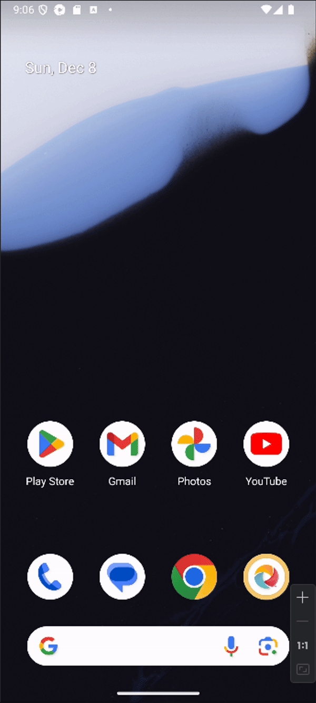

I will be writing this blog post and learning as I go, so it's a double first-time experience for me. The section on what Appium is has been skipped, as it's assumed that you're already familiar with it. Now, let's dive in.

###### Prerequisites
- NPM, how to install it you can find here: https://nodejs.org/en/download/package-manager
- Java Development Kit: https://www.openlogic.com/openjdk-downloads
- Android Studio, how to install it you can find here: https://developer.android.com/studio
- Android Debug Bridge (ADB): https://developer.android.com/tools/releases/platform-tools
- Your CPU should support virtualization
- Python3
- Appium-Python-Client

###### Prepare Android Studio
- Start Android Studio
- Start emulated device

###### Install Appium:
``` bash
npm i --location=global appium
```

###### Install UiAutomator2 
``` bash
appium driver install uiautomator2
```

###### Set environmental variables
Don't forget to change username. These are based on Ubuntu operating system, but you can get a good grasp on what must be set.
``` bash
export ANDROID_HOME=/home/<YOUR-USERNAME>/Android/Sdk
export PATH=$ANDROID_HOME/tools:$ANDROID_HOME/tools/bin:$ANDROID_HOME/platform-tools:$PATH
export JAVA_HOME="/usr/lib/jvm/java-1.11.0-openjdk-amd64"
export PATH=${PATH}:${JAVA_HOME}/bin
```

###### Create new directory:
``` bash
mkdir appium
```

###### Create and activate new Python envionment
``` bash
python3 -m venv venv && source venv/bin/activate
```

###### Install Appium-Python-Client
``` bash
pip3 install Appium-Python-Client
```

###### Find your emulated device name (which you started in Android Studio)
``` bash
adb devices
```

###### Save the below as a test.py
Don't forget to change device name to the one from previous step (e.g `emulator-5554`)
``` python
import unittest
from appium import webdriver
from appium.webdriver.common.appiumby import AppiumBy
from appium.options.android import UiAutomator2Options

options = UiAutomator2Options()
options.platform_name = "Android"
options.device_name = "<YOUR-DEVICE-NAME>"
options.app_package = "com.android.settings"
options.app_activity = ".Settings"
options.language = "en"
options.locale = "US"

appium_server_url = 'http://127.0.0.1:4723'

class TestAppium(unittest.TestCase):
    def setUp(self) -> None:
        self.driver = webdriver.Remote(command_executor=appium_server_url, options=options)

    def tearDown(self) -> None:
        if self.driver:
            self.driver.quit()

    def test_find_battery(self) -> None:
        el = self.driver.find_element(by=AppiumBy.XPATH, value='//*[@text="Battery"]')
        el.click()

if __name__ == '__main__':
    unittest.main()
```

###### Start Appium
``` bash
appium
```

###### Run your test.py
``` bash
python3 test.py
```

If everything is set up correctly, the following should happen:
- The Settings app on the emulator should launch automatically.
- The Battery settings page should be located and clicked by the test script.
- After the test completes, the app should be closed.
- In your Python test output should see "OK" printed in the terminal indicating that the test passed successfully.

