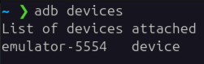
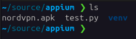

This is the follow up of the first blog post.

Let's start emulated device in Android Studio and then open the command line and run<br> `adb devices` to make sure that the device is there.


For the test purposes we can download Nord VPN application from https://nordvpn.com/download/android/ to the directory from the first blog post.


You can install this .apk file by simply dragging it onto the screen of the emulated device in Android Studio.
After it is installed we need to find out it's details for Appium. We can do this via `adb` commands in the command line.

To find the package name:
```bash
adb shell pm list packages | grep nordvpn
```

To find the main app activity (more on that later):
```bash
adb shell pm dump com.nordvpn.android | grep -A 1 MAIN
``` 

Now let's update your test.py file with the new `device_name`, `app_package` and `app_activity`.'
Also you would need to update the test itself. So the final `test.py` should look like this:
``` python3
import unittest
from appium import webdriver
from appium.webdriver.common.appiumby import AppiumBy
from appium.options.android import UiAutomator2Options  # Preferred way to handle capabilities

# Create capabilities using UiAutomator2Options
options = UiAutomator2Options()
options.platform_name = "Android"
options.device_name = "emulator-5554"
options.app_package = "com.nordvpn.android"
options.app_activity = ".mobile.MainActivity"
options.language = "en"
options.locale = "US"

appium_server_url = 'http://127.0.0.1:4723'

class TestAppium(unittest.TestCase):
    def setUp(self) -> None:
        self.driver = webdriver.Remote(command_executor=appium_server_url, options=options)

    def tearDown(self) -> None:
        if self.driver:
            self.driver.quit()

    def test_nord_first_screen(self) -> None:
        el = self.driver.find_element(by=AppiumBy.XPATH, value='//android.widget.TextView[@text="The fastest VPN on the planet"]')
        el.click()

if __name__ == '__main__':
    unittest.main()
```

Now everything should be set up:
- Android Studio opened with emulator ready
- NordVPN app installed on the emulator
- Appium started

Finally we can run our test, simply run it like this:
``` bash
python3 test.py
```

You should see how app opens, text has been asserted and `test.py` outputs `OK`
